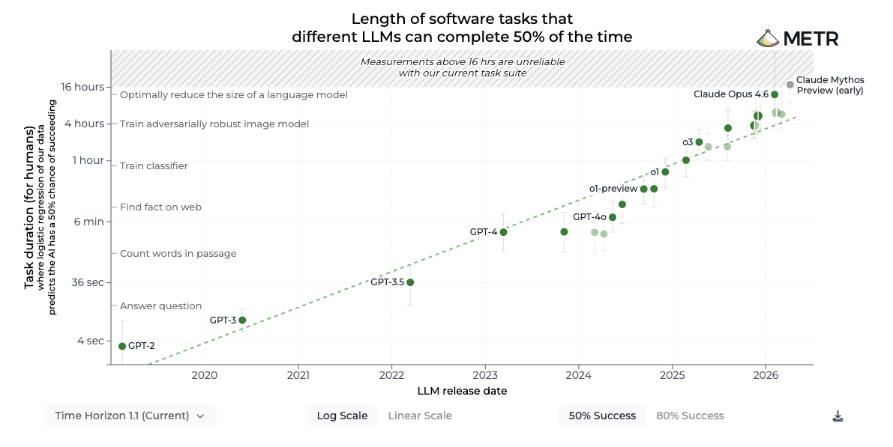

# Four axes of intelligence: putting frontier models on a physical ruler

One chart I check whenever it updates measures AI capability in hours. I understand hours even when I do not know which architecture is fashionable.

<figure markdown="span">
  { width="100%" }
  <figcaption>The hours belong to the human doing the task. Source: <a href="https://metr.org/time-horizons/">METR, Time Horizon 1.1</a>.</figcaption>
</figure>

The AI evaluation research organization METR first estimates how long each software task takes a human expert. It then tests AI agents on those tasks and fits a curve relating human task duration to an agent's probability of success. The duration where that curve reaches 50% is the agent's **50% time horizon**.[^metr]

A two-hour horizon therefore means that the fitted success rate is 50% for tasks of roughly that human-rated difficulty. The AI might finish a successful attempt in minutes. The number is neither its running time nor how far it can literally see into the future. Individual tasks vary, and the result describes the tested task distribution.

<!-- more -->

What I like is that it measures how much work a system can carry through. It connects to an older thought I had while watching *Dune*.

In Frank Herbert's science-fiction story, Paul Atreides gains extraordinary access to ancestral memory and possible futures, and eventually becomes emperor. I saw the films first and later read parts of the book. What stayed with me was the connection between knowing the past, anticipating what comes next, and gaining the power to shape events.[^dune]

<figure markdown="span">
  { width="100%" }
  <figcaption>The part of Paul's story that stayed with me: an extraordinary range of past experience and possible futures.</figcaption>
</figure>

I wondered whether intelligence might be understood in those terms. How much past information can a mind take into account? How far ahead can it use that information to produce a useful response? That response could be a prediction about the world, but it could also be a sequence of actions that brings about a desired future. My own possible actions belong inside the picture of the future too.

Two more questions followed. The amount of information is only part of the story: seeing, hearing, reading, and touching reveal different things, and a system can respond through words, sounds, images, or movement. And even a very capable system has to do its work with some amount of time and physical resources.

That gave me four candidate axes:

1. **Input capacity:** how much information a system can take in and use, including information retained from the past.
2. **Future-aware output:** how well its outputs account for distant consequences and relevant alternative futures, including predictions and action trajectories.
3. **Multimodality:** which physical kinds and ranges a system can sense and act through, and how much usable information it can handle through each.
4. **Efficiency:** the energy and time required to achieve those capabilities.

<figure class="yl-sketch">
--8<-- "docs/assets/images/blog/physical-units/fig-four-axes.html"
<figcaption>Four intuitions I wanted to put on a test bench.</figcaption>
</figure>

<blockquote>
<strong>Spoiler: I ranked AI in bits and joules.</strong> Near the end I put current frontier models on the same physical ruler. The result is a provisional scoreboard in bit, bit/s, and bit/(J·s): a falsifiable extrapolation from public model data, not a lab's measurement.
</blockquote>

<figure class="yl-sketch">
--8<-- "docs/assets/images/blog/physical-units/fig-provisional-scoreboard.html"
<figcaption>A preview of the ranking at the end. The labels are hypotheses under the stated reference rules, waiting for independent measurement.</figcaption>
</figure>

Could these be fundamental dimensions of intelligence? Could we describe them in units that would still make sense decades or centuries from now, after transformers have been replaced by something else? I want the subject to include humans, other animals, and kinds of intelligent being we have not yet imagined. A definition should not require them to contain components that resemble today's AI systems.

A transformer's context window, the amount of input it accepts at once, is an obvious place to start today. But its token count depends on how text is divided into tokens, and it doesn't tell us how much of that input affects the answer. In *Lost in the Middle*, Liu and colleagues found that moving relevant information into the middle of a long input often hurt performance on their question-answering and retrieval tasks.[^lostmiddle] I wanted a description that could survive changes in representation and hardware. Bits, which measure information, and joules, which measure energy, seemed promising.

I went looking for work that could challenge the idea. Information theory, which studies how information can be quantified and transmitted, and thermodynamics, which studies energy, heat, and work, already had results that addressed parts of the problem. Research on universal intelligence tests had also asked how to evaluate biological, artificial, and future systems within one framework.[^universaltest] My four axes would still need their own definitions.

I kept one rule for the rest of this essay: each axis has to answer four questions. What is measured? What experiment produces the number? What is its unit? What does the number mean? The warehouse examples show how to start; the encounters with existing theory show where my first versions broke.

For input capacity and future-aware output, I use 90% accuracy as an initial acceptance threshold. For multimodality, I account for errors continuously, so weaker abilities can still contribute. These are measurement choices. Each result also needs its task, input conditions, allowed learning, and time limits. The subject's own ability to understand the signals and produce a response belongs in the test. A bat's use of ultrasound and a person's use of language are capabilities to examine, rather than differences for the evaluator to remove by doing the interpretation for them.

## 1. Input: how much can the system actually use?

Imagine a robot delivering parcels in a warehouse. It receives instructions, watches the aisles, and remembers things it saw earlier. Its output might be a delivery plan or the commands that move its wheels and gripper. I will keep returning to this robot, because all four axes matter to the same job.

For the input axis, I want to know how much information the robot can handle together. A system that can use a long history of instructions and observations has a capability that one limited to the latest image may lack. But how should I measure that difference?

Recorded bytes tell us how much a device stores. To measure usable input, I would also ask whether it can retrieve the information that a later question requires. A recorder with reliable retrieval could score well on this axis. It could still be terrible at planning. Good memory and poor foresight are a useful distinction for four axes to preserve.

The Argentine writer Jorge Luis Borges imagined a human version of this problem in his short story *Funes, the Memorious*. Its central character, Funes, remembers individual details with extraordinary precision, but struggles to form general concepts. He is troubled even by calling a dog seen from two different angles the same dog. The narrator suspects that this flood of detail gets in the way of thinking.[^funes] The story makes the distinction memorable; it is not evidence that increasing a computer's memory must make it less intelligent.

Return to the robot. It passes a sign saying which of two loading bays to use. Each bay is equally likely to be the destination. The sign also has a random decorative pattern that tells it nothing about the destination. At the next junction, the sign is no longer visible.

The robot could remember every pixel, or just the destination. In this example, one binary choice is enough: left bay or right bay. That choice can be stored in **one bit**. If we care about the information learned, finding out which of two equally likely alternatives is correct also removes one bit of uncertainty. Storage capacity and information learned are different quantities, even though both use bits.

Keeping only the destination would be **compression**: representing the input with less data. It works here because the discarded pattern doesn't change the required turn. If the pattern later became relevant to another task, that compressed memory might no longer be enough.

There is a related idea in the study of **predictive information**. Bialek, Nemenman, and Tishby ask how much knowing a process's past reduces uncertainty about its future.[^bnt] It measures predictive structure available in the process, rather than how many bytes somebody recorded. A learner may or may not discover that structure.

A field called **computational mechanics** takes this further. Shalizi and Crutchfield group past histories that imply the same probability distribution over future observations.[^causalstates] If two different histories lead to exactly the same predictions, a predictor can remember their shared predictive state instead of every difference between them. Our differently decorated destination signs suggest the idea, although the formal result concerns whole future distributions, not just one correct turn.

This doesn't mean the best memory is always the smallest. Suppose the robot receives the destination of every parcel before it learns which parcel it must deliver. Each destination is chosen independently between two bays. Keeping only one destination will not be enough, because the question arrives later.

The experiment would be simple enough to run: show the robot a fresh set of destinations, remove the original instructions, wait ten seconds, and then select one parcel at random. Check whether it still knows the destination. Repeat with new assignments and different queries, increasing the amount of information. The presentation time, retention interval, and response deadline stay part of the measurement. Any notes the robot makes belong to the system being tested.

<figure class="yl-sketch">
--8<-- "docs/assets/images/blog/physical-units/fig-input-test.html"
<figcaption>The question is chosen after the input disappears. Remembering only a convenient answer in advance will not pass this test. Each destination is an independent binary fact.</figcaption>
</figure>

I would call the largest amount of information demonstrated this way **usable input capacity**, $C$, measured in bits. Errors need to reduce the credit. For example, if a system receives 1,000 independent binary facts and later answers random queries with a true error rate of 10%, a standard information-theoretic bound certifies about 531 bits of retained information. It does not certify perfect recall of all 1,000 facts.[^fano]

That is a deliberately conservative candidate. It tests how much new input remains available under the stated conditions; it does not claim to inventory every fact a person or model has learned in its lifetime. Repeating the same instruction a thousand times does not turn it into a thousand independent facts.

??? note "How the input number accounts for errors"

    Let $n$ be the number of independent, equally likely binary facts and $e_n$ the error rate on a randomly chosen fact. Use a conservative upper estimate of that error rate when working with finite data. The binary entropy function is

    $$h_2(e)=-e\log_2e-(1-e)\log_2(1-e).$$

    It measures uncertainty about whether a binary answer is wrong. We take $0\log_2 0=0$. At zero error, $h_2(e)=0$; at random guessing, $h_2(0.5)=1$. My candidate is

    $$C=\max\bigl(\{0\}\cup\{n[1-h_2(e_n)]:e_n\leq0.1\}\bigr)\quad\text{bit}.$$

    The maximum is over tested input loads under the same conditions. For $n=1000$ and $e_n=0.1$, the expression is about 531. The mathematical lower bound assumes the facts are independent and the later query does not supply their answers. It concerns the state available to generate a response, without requiring a particular memory component.

    For a classical response state, the bound follows by applying binary Fano to each fact, then combining the conditional-entropy bounds and using the concavity of binary entropy. Nayak proves a related storage bound for quantum random-access encodings.[^randomaccess] His stated theorem requires a decoding guarantee for every bit of every encoded string, a stronger condition than this experiment's average-error criterion. Neither result establishes that this is a complete measure of memory or intelligence.

    A real test needs fresh validation trials and uncertainty estimates. Learning or fatigue can make repeated trials dependent, so a binomial error model should not be assumed automatically. If the system passes the largest tested load, the result is a demonstrated lower bound on its capacity. If we cannot establish a workable interaction at all, that is an unsuccessful measurement, not evidence of zero intelligence.

## 2. Output: how far and how broadly can it look ahead?

Suppose the robot must deliver a fragile parcel before a deadline. One route is short but sometimes blocked; another is longer but more reliable. The robot needs to consider the consequences of its own choices: how fast it can travel, whether a turn could damage the parcel, and what it could do if a door is closed.

Its output might describe those possibilities in words. It might instead specify a route and a sequence of movements. An **action trajectory** describes actions or motion over time, such as when to move, turn, stop, or close the gripper. Both are outputs I want this axis to cover.

By *far*, I mean how far ahead the consequences remain useful to the task. By *broad*, I mean the relevant possibilities and consequences the output accounts for. A plan that works only if every door is open has considered less of this situation than one that also handles a blocked route. Neither a long answer nor a long list of imagined futures establishes this ability; we have to examine whether the output is accurate, useful, and feasible.

<figure class="yl-sketch">
--8<-- "docs/assets/images/blog/physical-units/fig-output-futures.html"
<figcaption>The same output question includes forecasts and action trajectories. The robot's own movements are part of the futures it considers.</figcaption>
</figure>

By strategic prediction I mean this: given what the system has learned, what output should it produce now to achieve the goal later? The body matters because the proposed actions must be possible for it. For a comparison between models, we would therefore need to specify the actions and tools each one can use.

Existing research provides ways to make parts of this question precise. **Predictive state representations** describe a system through predictions about what would be observed after possible action sequences.[^psr] For the warehouse robot, that could mean answering “If I take this aisle and turn left, what will I see?” The representation connects past observations to the consequences of possible actions.

**Model predictive control** uses a model to predict the results of candidate actions, chooses a sequence that serves an objective while respecting constraints, and applies the first action before updating the calculation with new observations.[^mpc] For the robot, the constraints might include its speed and turning limits. Prediction and action selection are parts of one continuing process. That is one concrete route to the future-aware output I have in mind.

To measure the extent of this ability, picture the possible futures as a tree. Its **depth** is the chain of consequential choices or changes. Its **branching width** is the number of relevant alternatives at each point. Those give concrete meanings to looking far and broadly. Waiting an extra hour before an otherwise identical job begins adds neither depth nor width.

Start with a controlled warehouse in which each junction has two routes and a delivery requires four junctions. There are sixteen paths. Another layout might have four routes at each of two junctions, also giving sixteen paths. If each path corresponds to a distinct task-relevant case and the cases are tested equally, choosing among them requires four bits of information.[^shannon]

$$Q=\log_2(b^d)=d\log_2 b.$$

Here $b$ is the number of relevant branches at each junction, $d$ is the depth, and $Q$ is the path information in bits. Sixteen equally likely cases give $\log_2 16=4$ bits. Four choices at each of four levels give 256 cases, or eight bits.

<figure class="yl-sketch">
--8<-- "docs/assets/images/blog/physical-units/fig-future-tree.html"
<figcaption>Depth and branching width both contribute to the number of relevant future cases. These two trees contain the same path information. Equal information does not imply equal difficulty, so the measurement must test both structures.</figcaption>
</figure>

The tree belongs to the experiment. The system does not earn points for drawing a larger one. In prediction trials, ask which outcome a given course of action will produce. In action trials, give a destination and check whether the system's choices reach it. Rearrange the warehouse between trials so it has to use the new situation. Change a distant destination or constraint and check that its first, irreversible choice changes appropriately. A long corridor that can be followed without considering anything ahead would not demonstrate the same ability.

I would call the largest future information load it can handle across the required structures **future distinction capacity**, $F$, also measured in bits. It has to meet the accuracy threshold in each required prediction and action task group. At perfect performance, sixteen cases earn four bits; at a true whole-task error rate of 10%, the conservative error correction gives about 3.14 bits. The full formula is below.

This measures what its outputs accomplish. A system may reach the right result through simulation, a learned shortcut, or some method I cannot inspect. The test does not require a verbal account of its thinking or proof that it explicitly visited every branch. But a random wanderer does not get credit merely because its movements reach many different places: the result has to match the requested goal.

The definition makes one deliberate choice. I give the same information value to a deep, narrow tree and a shallow, wide one with the same path information and accuracy. Their difficulty can differ considerably. That is why the test must vary their structure, and why these bits should not be described as a complete measure of reasoning difficulty. METR's human-rated task duration offers a different way to calibrate difficulty; it is not a conversion factor from hours into these bits.

??? note "The future-output measurement in full"

    Let $N$ be the number of equally likely, distinct future cases, with outputs interpreted against a fixed answer or goal. Let $e_N$ be the conservative whole-task error estimate for the worst-performing required task group at that size. This differs from the error on one queried fact in the input test. Fano's inequality gives the information lower bound:[^fano]

    $$f(N,e)=\max\{0,\log_2N-h_2(e)-e\log_2(N-1)\}.$$

    My proposed scalar is

    $$F=\max\bigl(\{0\}\cup\{f(N,e_N):e_N\leq0.1\}\bigr)\quad\text{bit}.$$

    For sixteen cases at 10% error, $f(16,0.1)\approx3.14$. The bound is established information theory; using it in this future-task measurement is my proposal. If the cases are not equally likely, replace $\log_2N$ with the entropy of the declared case distribution. Labels that describe the same case and branches that change no relevant outcome or required response must be merged before counting.

    A small first implementation can use $N=2^n$ for $n=1,\ldots,8$. For every divisor $d$ of $n$, set $b=2^{n/d}$ and test that depth and width. Randomize destinations and transitions, evaluate both prediction and action, and validate on fresh worlds. Passing one favourite tree is not enough.

    This initial version uses finite outcomes and deterministic transitions. It does not demand advance knowledge of an intrinsically random event. For probabilistic forecasts, **strictly proper scoring rules** offer a useful starting point: they score stated probabilities against observed outcomes, with the best expected score obtained by reporting the true probabilities.[^scoring] Connecting such scores to this proposed capacity would require further work. Even perfect discrimination on these small trees would not establish broad competence at language, tool use, or scientific reasoning.

### Why a small failure rate matters

A simple calculation shows why completing a long sequence is demanding. Suppose a job has $n$ steps, every step succeeds with probability $p$, the successes are independent, and any failure ends the job. Then the chance of finishing is $p^n$. At a 50% success threshold, the continuous step count is

$$H_{50}(p)=\frac{\ln(0.5)}{\ln p}.$$

Here $H_{50}$ is the hypothetical job length and $\ln$ is the natural logarithm. At 90% success per step, the result is about 6.6 steps. At 99%, it is about 69. The largest whole number of steps meeting the threshold is the result rounded down.

<figure class="yl-sketch">
--8<-- "docs/assets/images/blog/physical-units/fig-kappa-curve.html"
<figcaption>A calculation under independent-step assumptions, not measurements of real agents. Real systems can detect errors, retry, and change their plans.</figcaption>
</figure>

I initially tried to turn a slope of this relationship into a diagnostic called “horizon elasticity.” It was supposed to help compare how agents gained future reach as reliability improved. But this model fixes the relationship in advance. It cannot explain differences in recovery or strategy that it never represents. The calculation helps explain a difficulty; it is not yet a measurement of all the ways an agent can overcome it.

??? note "What went wrong in the earlier sampling calculation"

    Brown and colleagues' *Large Language Monkeys* studies repeated attempts at tasks. On SWE-bench Lite, a benchmark of software issues, they report **coverage**, the fraction of issues with at least one successful attempt, rising from 15.9% with one sample to 56% with 250 samples.[^monkeys] These are task-level coverage figures, not per-step probabilities or a guarantee of selecting the correct attempt.

    Substituting them for $p$ in the toy model is therefore an extra, unvalidated assumption. With that substitution, the exact formula gives a hypothetical horizon ratio of about 3.17; the high-reliability approximation $H\approx\ln(2)/(1-p)$ gives about 1.91. A power law fitted to these two endpoints has a sample-count exponent of about 0.209 or 0.117, respectively. Extending those fits would require about 28 or 368 times as many samples to double the hypothetical horizon. These are projected compute costs, not performance gains.

    It also mixed up different slopes. Writing reliability as $b=-\log_2(1-p)$, the old curve was $d\ln H/db$, the change in log horizon per extra reliability bit. Elasticity in $b$ would instead be $d\ln H/d\ln b$. Correcting the label and arithmetic still doesn't validate the assumption that whole-task success can be used as per-step reliability.

## 3. Multimodality: which parts of the world can it reach?

Our robot reads an instruction, sees a parcel, hears a warning, and feels through its gripper that something is slipping. It can respond with words, sound, or movement. These different forms of input and output are called **modalities**. I want this axis to measure both their physical variety and how much useful information the system can handle through them.

Adding up bits per second would capture only part of that ability. Consider four equally likely parcels: red and light, red and heavy, blue and light, blue and heavy. Colour and weight are independent. An ideal colour-only camera tells the robot which colour it sees; an ideal scale tells it which weight category it has.

Either observation reduces four possibilities to two, supplying one bit. But the camera helps select a red parcel, while the scale helps select a heavy one. Equal information quantities can give access to different facts about the world.

<figure class="yl-sketch">
--8<-- "docs/assets/images/blog/physical-units/fig-blackwell-parcels.html"
<figcaption>Each observation resolves one independent binary choice. A copy of the colour reading adds no information about weight.</figcaption>
</figure>

The statistician David Blackwell formalized a comparison that preserves this distinction. For experiments about the same hidden state, one channel is at least as useful in every decision problem when its observations can reproduce the other's through processing alone. That processing may add noise, but cannot consult the hidden state itself; processing costs are left out of this comparison.[^blackwell] In this example, neither colour nor weight determines the other. Their information amounts are equal, but each enables a decision the other cannot resolve. I want a representative number that rewards gaining both kinds of access.

### A physical map that can grow

Human sensory names are too narrow for that map. Light and sound are physically different signals: light is electromagnetic radiation, while sound is a disturbance travelling through matter. Mass, position, and speed describe properties we might learn about through those signals. An image file describes a representation further along the chain. Counting all these names as equivalent kinds would mix together what exists, how we encounter it, and how we describe it.

I would identify a test by the **external physical state it asks the system to distinguish or change, the allowed interaction, and the range being tested**. This can describe a person's touch, a robot's gripper, or an unfamiliar future means of acting. It does not prescribe an internal architecture. The following is a working map of tests, with overlapping descriptions still to reconcile.

| Physical differences to test | Examples of ranges to specify |
|---|---|
| Electromagnetic fields and radiation | Frequency, field strength, spatial scale |
| Mass, position, motion, and deformation of matter | Mass, length, speed, force, vibration frequency |
| Temperature and heat flow | Temperature, temperature difference, rate of change |
| Composition and internal states of matter | Substance or particle type, concentration, energy |
| Gravity and spacetime | Spatial scale, strength and timing of changes |

This map should cover today's organisms and a future intelligence working at astronomical scales. IceCube, the neutrino observatory in Antarctica, is a useful example beyond familiar senses. A neutrino interacting with the ice can produce charged particles that emit light. The observatory uses that light to infer properties of the original event.[^icecube] Its final readout is optical, but the whole process gives access to neutrinos. Classifying it only by the last signal would lose the capability I wanted to measure.

The map is not yet a set of independent boxes. Temperature and molecular motion are related descriptions; a light wave's wavelength and frequency are linked. A test must prevent the same distinction from earning credit twice. The international vocabulary of metrology also notes that grouping physical quantities into kinds involves some convention.[^quantitykind] I would begin with equal reference weight for comparable intervals of different kinds, without a bonus for rarity or present technical difficulty. Defining those comparable intervals remains part of the work.

??? note "Why not just count degrees of freedom?"

    A degree of freedom is an independent way a state can vary within a model. That is useful language for constructing the tests. But many independently varying points of light can still all belong to vision. More independent variables do not by themselves establish access to more physical kinds.

    Conversely, names can multiply without adding a new independent variable. For positive distances, giving both a distance and its square does not describe two freely varying properties. Changing coordinates or units should preserve the physical test and its reference weight. This is why I need a map of actual distinctions and interactions, rather than a count of columns in a representation.

### The same ruler at different scales

Within a suitable positive physical quantity, I would give equal weight to equal multiplicative ranges. A length range from one micrometre to one millimetre spans a factor of a thousand. So does one kilometre to a thousand kilometres. At the same relative precision, I give those ranges the same reference weight. A system that handles the entire interval between their outer limits covers more of the map.

<figure class="yl-sketch">
--8<-- "docs/assets/images/blog/physical-units/fig-physical-ranges.html"
<figcaption>A proposed scale rule for the same physical quantity. Every tenfold interval has the same reference weight. The bottom range includes the six intervening intervals as well as the three at each end. These are reference ranges, not measured abilities.</figcaption>
</figure>

This is a logarithmic ruler: one step means multiplying by ten. It treats an expansion toward smaller scales like an equal expansion toward larger ones. It also avoids choosing a maximum scale based on what today's organisms or machines happen to reach.

There is a consequence. Infinitely many equally weighted intervals cannot add up to 100%. I therefore keep a fixed weight per physical interval instead of expressing every interval as a fraction of the whole universe. Extending the reference into an untested range then leaves the existing contribution unchanged. A newly tested ability can add to it. Each result still needs its reference specification so that we can tell when two measurements use the same ruler.

### Combining range and rate

For each declared physical test region, measure how much information the system actually distinguishes or expresses per second. Include both input and output tests, with their reference weights fixed in advance. A physical output test might ask the robot to place an object at one of several target positions and check where it ends up. Merely writing the target's name would satisfy a different test.

Let $a_i$ be region $i$'s fixed, dimensionless reference weight, and $R_i$ its verified information rate after accounting for errors. My candidate **multimodal information rate**, $M$, is

$$M=\left(\sum_i\sqrt{a_iR_i}\right)^2\quad\text{bit/s}.$$

The square roots reward spreading a fixed total rate across equally weighted regions. Squaring the sum makes the value scale with speed: doubling every rate doubles the score. Those are the two properties I wanted this particular formula to preserve.

The calculation uses rates achieved together over the same measurement interval. A system that can receive 100 bit/s or send 100 bit/s, but cannot do both at once, does not get to add those separate maxima. If it switches between activities, the switching and waiting take part of the shared time.

For two regions with reference weight one each, 100 bit/s in one and none in the other gives $M=100$. Splitting the same total rate evenly, 50 bit/s in each, gives $M=200$. Processing 200 bit/s in just one also gives $M=200$. This states the exchange I want to try: twice the equally weighted breadth can compensate for half the total rate.

<figure class="yl-sketch">
--8<-- "docs/assets/images/blog/physical-units/fig-multimodal-rate.html"
<figcaption>Three constructed operating points under the same two-region reference. A and B exchange 100 bit/s in total, but B covers both regions. B and C receive the same representative value. The formula incorporates a chosen exchange between physical breadth and rate; it is not a law of nature.</figcaption>
</figure>

The unit remains bit/s under this reference convention, but $M$ is a value adjusted for physical breadth, not the literal number of bits transmitted. That is why it can exceed the raw total. A sufficiently fast specialist can still outscore a slower generalist. A duplicate feed earns neither a new reference region nor new information.

I would account for errors continuously here, without the 90% acceptance threshold used for the first two axes. In a balanced binary test with 100 answers per second, a true accuracy of 51% gives an information lower bound of about 0.029 bit/s; 90% gives about 53.1 bit/s. Weak ability receives small credit. Random guessing receives none.[^fano] Fresh validation and uncertainty estimates must establish the difference: a few lucky answers do not demonstrate a weak new sense.

Accuracy also depends on what must be distinguished. Telling whether a parcel is near or far is a coarser test than locating it among a thousand positions. The experiment must state its resolution, signal strengths, noise, and timing. My next protocol candidate would distribute a region's existing reference weight across several external noise conditions, and include both sustained throughput and timely responses. Response deadlines could follow the phenomenon's rate of change. The particular noise mixture and timing rules remain open choices; I would not yet present one as the standard for every being.

This gives me a concrete candidate to test, along with two tasks the formula cannot do for me: construct physical reference regions without double counting, and show that the comparison survives changes in systems and test conditions. The robot's colour, contact, and movement tests are small places to begin. The same description should leave room for a being whose physical reach extends far beyond that warehouse.

??? note "Measurement, error correction, and checks on the formula"

    A first experiment can present fresh, independently randomized states in each input region and request independent targets in each output region. Fix the meanings of responses and the required physical precision before validation. Use a common elapsed interval $\tau$ and set $R_i=I_i/\tau$, where $I_i$ is a conservative bound on information correctly used in that region. Correlated signals and tasks that require combining senses need their own accounting; the formula does not automatically separate their unique and shared information.

    For $N\geq2$ equally likely alternatives and error estimate $e$, use

    $$e_c=\min\{e,1-1/N\},\qquad b_N(e)=\max\{0,\log_2N-h_2(e_c)-e_c\log_2(N-1)\}.$$

    This is a Fano-based information lower bound, with zero task credit at or below chance performance under the fixed response meanings. The extra convention matters: a binary answer that is always the opposite of the target can have high mutual information while failing the stated task. A decoding rule fixed before validation can interpret a legitimate code; fitting a favourable interpretation after seeing the answers would invalidate the test. For binary facts, this reduces to $1-h_2(\min\{e,0.5\})$ bits per answer. Finite-data error bounds must account for trial dependence and the selection of promising regions or operating points. Near misses and distant errors can lose the same credit in this initial bound, so the tested resolutions must also be reported.

    The representative number is the largest value validated at an actually achievable operating point under the common protocol. Untested regions receive no demonstrated contribution; this reports a lower bound, not proof that the system lacks those abilities. A common protocol fixes how input, output, noise, and response conditions share reference weight. Adding another name or test condition cannot copy that weight.

    The scale rule can be written $a=c\log_{10}(x_{\max}/x_{\min})$ for a positive quantity and a fixed coefficient $c$. In the length illustration, $c=1$ gives weight three to each thousandfold range. The ratio is unchanged when metres become millimetres. Frequency and wavelength descriptions must carry the same physical reference with them. Zero, sign, direction, discrete composition, and joint variables require additional rules; a logarithm of every listed quantity is not a finished physical taxonomy.

    The formula is unchanged when a uniformly tested region with weight and rate $(a,R)$ is merely relabelled as $n$ equal pieces with $(a/n,R/n)$. Coverage must be sampled across a region, rather than inferred from success at one point. A finer test can reveal that a system only handles a narrow part of what a coarse test appeared to cover. That is new evidence about its range. Increasing any verified rate while keeping the others fixed never reduces the score, and multiplying all rates by the same factor multiplies the score by that factor.

    For a finite tested reference weight $A=\sum_i a_i$, the Cauchy–Schwarz inequality gives $M\leq A\sum_iR_i$. Finite total rate alone does not guarantee a finite score over an infinite reference: if $a_i=1$ and $R_i=1/i^2$, the total rate converges but the square-root sum diverges. I therefore report the finite range actually verified, and make no claim to have measured an untested infinity of physical access.

## 4. Efficiency: what does that capability cost?

Suppose two systems can complete the same delivery with the same reliability. One takes longer or uses more energy. That difference belongs in a comparison of their efficiency. A system that saves energy by failing to deliver the parcel hasn't met the same requirement.

We need a few distinctions before comparing numbers. **Energy**, measured in joules (J), is an accumulated quantity. **Power**, measured in watts (W), is energy used per second. A hypothetical device drawing 10 W for 3 seconds uses 30 J. Completing a job faster and completing it with less energy are two different improvements.

For the fourth axis, I want both improvements to count. My candidate is useful performance divided by the product of energy and elapsed time:

$$\eta=\frac{V}{\bar E\,\bar T}\quad\text{bit/(J\cdot s)}.$$

Here $V$ is the verified future-task information achieved on a common workload, calculated with the same error correction as $F$. It is not output length. $\bar E$ is average energy per attempt and $\bar T$ is average elapsed time, including failed attempts.

The cost interval includes the learning and practice needed during this evaluation, as well as the final performance. If one learning phase serves many trials, its cost is allocated over the same declared number of trials for every system. Existing knowledge remains part of the starting state. This measures the cost of learning and acting now; it does not amortize a human's childhood, an AI's original training, or the creation of the organism or machine.

Consider two systems that meet the same performance requirement. One uses 1 J and takes ten seconds. The other uses 10 J and takes one second. Their energy-time products are equal, so they receive the same efficiency score. A third system using 1 J in one second scores ten times higher for the same result.

<figure class="yl-sketch">
--8<-- "docs/assets/images/blog/physical-units/fig-efficiency-tradeoff.html"
<figcaption>The proposed energy-time tradeoff, at the same verified performance. A and B tie because each uses 10 J·s. C uses 1 J·s and scores ten times higher. These are hypothetical systems.</figcaption>
</figure>

That exchange is a choice I am making: a tenfold speedup offsets tenfold energy use. The energy-delay product already has a precedent in processor design: Gonzalez and Horowitz used it to compare energy and speed together.[^energydelay] Applying it to verified cognitive performance is my proposed use here. Thermodynamics does not dictate that preference. At constant power, taking twice as long doubles both energy and time, reducing this score to one quarter. Stating that consequence is part of defining the quantity.

The robot's battery reading would miss a remote service doing work for it. Its current costs need to include the resources actually used, wherever they are. Unknown energy is not free energy, and doing nothing does not satisfy the performance requirement. Information-per-joule proposals in recent work likewise require explicit measurement and accounting conditions.[^physicalintelligence] Before trusting a physical comparison, I also need to know what each reported joule paid for.

A provider's **output tokens per second is therefore not this efficiency axis**. The same model can produce tokens faster after a hardware or serving change while using more energy per useful task. Token speed is a deployment-throughput observation. $\eta$ asks a different question: after fixing the successful task, how many joules and seconds did the complete system spend?

### Why erasing a bit has an energy bound

A memory bit has two logical states, 0 and 1. **Resetting** an unknown bit means making it 0 regardless of its previous state. The final 0 no longer tells us whether the initial state was 0 or 1. This many-to-one operation is what “logically irreversible” means here.

Landauer's principle connects that loss of information to physical entropy, a measure of the uncertainty over physical states. In this idealized reset, making the memory state definite reduces its entropy; the surroundings must compensate, and transferring heat to them provides that compensation. In the standard idealization, resetting a bit initially equally likely to be 0 or 1 transfers at least the following average heat to the surroundings:[^landauer]

$$Q_{\mathrm{bath}}\ge k_BT\ln 2.$$

$Q_{\mathrm{bath}}$ is heat released to a thermal reservoir, an environment treated as staying at temperature $T$. $T$ is measured in kelvin, and $k_B$ is Boltzmann's constant, which converts temperature into an energy scale. At 300 K, the bound is about $2.87\times10^{-21}$ J per reset. This special case assumes the two memory states have equal energy and there is no usable side information about the old bit. It does not assign that cost to every computation or output.

Charles Bennett showed why the distinction matters.[^bennett] A logically reversible computation preserves enough information to retrace its steps. It can copy out its result and then undo its intermediate operations, restoring temporary working memory without simply discarding its history. This is not time running backwards; it is a sequence of operations that undoes earlier operations. Real hardware still has costs. We just cannot derive a universal price per computation by assuming every operation resets an unknown bit.

### Compare the same kind of cost

Mark Horowitz's ISSCC 2014 presentation gives rough energy estimates for operations in a 45 nm chip technology: about 0.1 pJ for a 32-bit integer addition and 1.3–2.6 nJ for a 64-bit DRAM access.[^horowitz] DRAM is the computer's main memory; accessing it moves data rather than performing the addition. A picojoule is $10^{-12}$ J and a nanojoule is $10^{-9}$ J, so the memory access costs roughly as much energy as 13,000–26,000 such additions in that example. The operation and technology must stay attached to the number.

Biological operations need their own definitions. Adding an amino acid to a protein and copying a DNA nucleotide select from different sets of possibilities. In Kempes and colleagues' idealized accounting, their biochemical energy estimates are about 26 and 165 times the theoretical bounds for those respective operations.[^kempes] Those bounds are different: neither ratio treats an entire biological operation as one binary reset.

<figure class="yl-sketch">
--8<-- "docs/assets/images/blog/physical-units/fig-energy-ladder.html"
<figcaption>Top: energy per specified hardware operation. Bottom: each biological operation's estimated energy divided by its own theoretical bound. These are separate comparisons, not a ranking of intelligence.</figcaption>
</figure>

??? note "Where the biological ratios come from"

    In the paper's model of protein translation, adding an amino acid selects from 20 equally represented types. Its idealized bound is $k_BT\ln 20$, about $1.24\times10^{-20}$ J at 300 K. The biochemical estimate is about $3.17\times10^{-19}$ J per amino acid, roughly 26 times the bound.

    DNA copying uses an idealized alphabet of four nucleotides. Its bound is $k_BT\ln 4$, about $5.74\times10^{-21}$ J. The estimated cost is $9.50\times10^{-19}$ J per nucleotide, about 165 times the bound. These are the paper's particular entropy and biochemical accounts, not efficiencies of entire organisms.

My first energy figure put molecular operations, neural signals, floating-point operations, and behavioural output bits on one axis. I had labelled it “energy per bit,” but the denominators referred to different things. Putting all the values in joules had not made the comparisons meaningful. The two panels above are what survives that correction.

For AI deployment, a cost comparison also needs to specify the model, task, output length, hardware, and batching. Luccioni, Jernite, and Strubell measured inference energy across ten tasks on the same GPU, without batching, and examined the relationship between output length and emissions.[^luccioni] Their results attach costs to particular deployments. For our robot, the relevant comparison would report what was delivered successfully and the resources used to do it.

## A physical connection between the axes

So far I have treated the axes separately to explain them. But retaining input and predicting useful outputs can affect energy costs. A small physical thought experiment makes that connection easier to picture.

Imagine one gas particle in a box divided by a movable partition. If a device knows which side contains the particle, it can let the gas expand against the partition and extract work. Work here is energy transferred by a controlled physical action, such as moving the partition. Information about which side is occupied matters; other details need not help that operation. Measuring and storing the information also have to be included in the accounting.

Susanne Still's 2020 paper studies partially observable information engines of this kind: the device cannot directly see everything it needs to know.[^still2020] For a cycle kept at one temperature, she derives a lower bound on heat dissipation based on how much retained information is irrelevant to extracting work. The connection is specific to the engine and its cycle; it is not a general rule charging every AI an identical amount for each useless bit.

An earlier result by Still, Sivak, Bell, and Crooks considers a physical system tracking an external signal that it does not influence.[^still2012] Its physical state carries a memory of the signal. The authors compare information about the current signal with information predictive of the next one. During a particular change in the driving signal, that difference is proportional to dissipated work: the part of the supplied work that is not retained as recoverable free energy. Free energy describes the system's capacity to supply work relative to its surroundings.

<figure class="yl-sketch">
--8<-- "docs/assets/images/blog/physical-units/fig-still-ledger.html"
<figcaption>A relation within Still et al.'s 2012 model. The memory terms are information quantities, expressed here in bits. The equality applies to the specified driving step; the complete process can dissipate additional work.</figcaption>
</figure>

I had wanted bits and joules because the units would outlast a particular model architecture. Here was a result that actually connected them. But the connection came with a physical setup, an update procedure, and a clear definition of the information being counted. Those details were doing essential work. The warehouse robot changes its surroundings when it acts, so applying such a result to it would require further modelling, not just replacing the word “system” with “agent.”

## Four quantities, and what remains to prove

I can now put a candidate measurement next to each of the four intuitions.

| Quantity | What the number measures | Unit |
|---|---|---|
| $C$ | Input information demonstrated to remain available for later queries | bit |
| $F$ | Future distinctions handled by accurate predictions and goal-directed outputs | bit |
| $M$ | Verified input and output rates combined with fixed weights for physical kinds and ranges | bit/s, adjusted for physical breadth |
| $\eta$ | Verified performance divided by this evaluation's energy-time product | bit/(J·s) |

These definitions make choices a reader can inspect. Good memory can coexist with poor planning. Different tree shapes can carry the same future information. Wider physical access can compensate for a lower information rate, and equal multiplicative ranges receive equal weight at microscopic and astronomical scales. Faster performance can compensate for greater energy use under the stated rule. Each number comes from demonstrated behaviour under declared conditions, rather than a required inventory of internal components.

What I have not established is that these are four complete, independent, fundamental dimensions of intelligence. Memory can constrain information flow; a useful observation can make a long plan easy; learning can change all four values. The formulas do not remove those relationships. The third axis also needs a common physical reference whose regions can be compared without counting the same capability twice. Its formula states a proposed tradeoff; it does not settle that reference by itself.

The next test is transfer. A system should encounter unfamiliar rules, representations, and opportunities to use tools. Chollet makes a related distinction between performing a practised skill and acquiring new skills, while accounting for prior knowledge and experience.[^chollet] Learning affects how much input a system can use, which future problems it can solve, and how much information it can handle through a new channel; the evaluation's learning costs enter the fourth axis. A small route tree is a starting experiment, not evidence that all of this has already been covered. A general test also needs a defensible choice of environments and goals. Different choices can change which system looks capable.

I still want these measurements to make sense a century from now. The proposed units do not depend on transformers, and the experiments can ask what a system does without opening it up. But retaining the same unit while changing the task does not automatically preserve comparability. That is something the measurement programme has to demonstrate, rather than assume.

The METR chart appealed to me because its hour made a question concrete. I want a future reader to be able to look at these four numbers and ask equally concrete questions: what could this being remember, which futures could it handle, which parts of the physical world could it reach and at what rate, and what did that cost?

Paul's story began this line of thought with a mind reaching far into the past and future. The four experiments bring it back to something I can check: show a mind something new, ask what follows, give it a chance to act, and measure what it can actually carry through.

## A provisional physical-unit scoreboard

Here is the deliberately audacious part: I put current systems on the ruler even though the ruler is still provisional.

The table below is a **provisional extrapolation**, not a measurement report. I used each model's published context window, Artificial Analysis output speed and modality flags, and the public benchmark record. I then applied the four candidate protocols from this essay. The arithmetic is reproducible; the priors are contestable.

| Model endpoint | $C$ (bit, scenario) | $F$ (bit, scenario) | $M^\dagger$ (bit/s, proxy) | $\eta^\ddagger$ (bit/(J·s), scenario) | Artificial Analysis Index |
|---|---:|---:|---:|---:|---:|
| Qwen3.8 27B (xhigh) | ~17k | ~2.31 | ~898 | ~1.23e-4 | 34 |
| GLM 5.3 Flash | ~80k | ~3.29 | ~1,026 | ~7.25e-5 | 42 |
| Kimi K3 (max) | ~86k | ~4.20 | ~485 | ~1.12e-5 | 44 |
| DeepSeek V4.1 Flash (max) | ~86k | ~3.29 | ~2,552 | ~1.33e-4 | 39 |
| Claude Fable 5.1 (max) | ~100k | ~5.12 | ~785 | ~3.34e-5 | 53 |
| GPT-6 Astra (max) | ~125k | ~5.31 | ~761 | ~4.58e-5 | 53 |
| Muse Spark 1.3 (max) | ~80k | ~4.12 | ~4,345 | ~1.08e-4 | 48 |

The numbers are rounded to stop the table pretending to know more than it does. The external index is included as a comparator, not folded into my four scores.[^frontiermodels]

??? note "What I actually put into the calculator"

    The headline table uses one declared scenario. For $C$, I used $(W,\rho)$ pairs of (256k,.50), (1M,.60), (1M,.65), (1M,.65), (1M,.75), (1.05M,.90), and (1M,.60) in the table's model order. Here $W$ is the published context ceiling and $\rho$ is a prior for the fraction that survives the random-query protocol; only $W$ is a published model fact. For Astra, the high prior is motivated by its public long-context results, but it is still a prior.

    For $F$, I used $(n,e)$ pairs of (3,.09), (4,.08), (5,.08), (4,.08), (6,.08), (6,.06), and (5,.09) in the same order, and evaluated $f(2^n,e)$. The $n$ values are analyst priors about the largest future tree each system might pass, not observed tree trials.

    For $M^\dagger$, I constructed a response-rate proxy from the public output-speed values 46.1, 88.0, 41.6, 218.9, 67.3, 65.3, and 223.0 token/s, together with the declared native input channels. Qwen3.8 and Muse Spark receive the video term because their model pages list native video input; the other rows receive text+image terms. The conversion of 4 useful bit per output token, image 0.5 times, and video 0.25 times is my reference rule, not a fact about the models. It is not a physical $R_i$ measurement: output speed can change when a provider changes hardware or serving software.

    For $\eta^\ddagger$, I fixed a common illustrative workload of $V=3.14$ bit and 5,000 generated tokens plus 10 seconds of interaction overhead. I used energy priors of 0.06, 0.18, 0.60, 0.20, 0.31, 0.22, and 0.25 Wh, respectively. These are scenario inputs anchored only loosely to published inference-energy studies,[^inferenceenergy] not model-specific wattmeter readings. AA token/s is used only in the time part of this scenario and says nothing about joules. Changing the energy priors can reverse the $\eta$ ordering. The point of publishing them is to make that reversal visible.

### What the table is saying

**$C$ is the least trustworthy rank in the table.** Astra comes first only because this scenario gives it $\rho=0.90$ for a 1.05M-token window. That is a prior, not a measurement. The current Artificial Analysis comparison shows Kimi at 89% on AA-LCR v1.1, Claude Fable 5.1 at 85%, Muse Spark 1.3 at 83%, and Astra at 81%.[^frontiermodels] AA-LCR is not my random-access experiment either, so it cannot settle $C$. It does mean that the Astra-first order should not be described as an established long-context result. The defensible claim is narrower: the context ceilings are public; usable bits are not.

**The top of $F$ is plausible, but the decimals are invented.** Artificial Analysis gives Astra and Fable 5.1 the same overall index score of 53. Astra leads Terminal-Bench 4.0, while Fable leads SciCode and Humanity's Last Exam.[^frontiermodels] That supports calling them near-tied on future-aware work. It does not support a measured difference between 5.31 and 5.12, and neither model has taken the future Tree proposed here. The lower rows are a broad prior ordering, not evidence that Kimi, Muse, GLM, or DeepSeek would pass those same trees.

**$M^\dagger$ follows the proxy by construction.** Muse and Qwen receive breadth credit for native video input, while DeepSeek receives a large response-rate prior from its public output speed. That matches the visible API metadata and the familiar impression that Muse is fast and multimodal. It does not measure physical channel breadth, sensor noise, or unique bits per second. Astra's image reasoning can be excellent while its listed native coverage remains text and image. A real $M$ score requires a common physical probe and measured $R_i$ values. Under another set of physical reference weights, this ordering could change.

**The $\eta^\ddagger$ scenario puts DeepSeek first because of its assumptions.** Its high response rate and sparse-serving energy prior make the energy-time estimate large. Qwen and Muse follow. DeepSeek's public release does describe a smaller KV-cache footprint and lower deployment cost, which makes the direction plausible, but neither claim is a joule measurement for this workload.[^deepseekrelease] Claude and Astra carry larger assumed energy costs, while Kimi's large serving footprint dominates its denominator. Change the energy priors and the order can change. An API token-speed leaderboard cannot establish physical efficiency.

### Does it line up with familiar benchmarks?

As a sanity check, I ranked the seven models by the provisional axis values and compared those ranks with the Artificial Analysis Intelligence Index. This is a small, retrospective check, not independent validation. The priors partly reuse the same public evidence, and the current $C$ order even disagrees with the public AA-LCR snapshot, so a high correlation can be an echo of my assumptions.

| Provisional axis | Comparator | Spearman rank correlation ($n=7$) | Reading |
|---|---|---:|---|
| $C$ | Artificial Analysis Intelligence Index | **+0.75** | Long-context capacity broadly follows the frontier ordering. |
| $F$ | Artificial Analysis Intelligence Index | **+0.95** | The strongest alignment is on future-aware, agentic work. |
| $M^\dagger$ | Artificial Analysis Intelligence Index | **−0.34** | The constructed breadth proxy is intentionally not general intelligence. |
| $\eta^\ddagger$ | Artificial Analysis Intelligence Index | **−0.67** | Capability and resource efficiency are different axes. |
| $\eta^\ddagger$ | deployment speed / cost proxy | **+0.75** | A directional check only; dollars and provider hardware are not joules. |

The useful result is the disagreement, provided I label its source. $F$ resembles the frontier agentic ordering because its priors were chosen that way. $M^\dagger$ rewards a declared channel set and a deployment-rate prior, while a real $M$ would require physical probes. $\eta^\ddagger$ changes when the energy boundary changes. A one-number intelligence leaderboard cannot show those tradeoffs.

### The strongest objections, answered in advance

**“You chose the priors to make the rankings look familiar.”** Partly. The first version necessarily contains judgement calls: four tokens per binary fact, a conservative $\rho$ for context use, the Tree depth and error prior, the physical range weights, and an energy prior. That is why I publish every one of them. The table is a proposal for a measurement, not evidence that the proposal is already true. If an independent Tree test reverses the $F$ ranking, the test has taught us something and this table loses.

**“Those are not physical measurements.”** Correct. They are physical-unit **estimates** from public observations. The provocative claim is that the quantities can be stated in physical units and that a concrete protocol can be run. It is not that a blog post can replace a wattmeter, a controlled environment, or fresh trials.

**“The correlations are circular.”** They can be. The comparator is partly in the prior, and $n=7$ is tiny. I show the correlation to reveal where the proposal agrees with familiar evidence and where it intentionally diverges, not to claim statistical confirmation. The real test is preregistration followed by measurements from someone who did not choose the priors.

**“Why call this intelligence if the axes can trade off?”** Because I am not collapsing them into one IQ-like number. A system can remember more than it can plan, sense more than it can act on, or be more efficient without being more capable. The vector is the result.

I am publishing this scoreboard because a useful unit should be easy to attack. If the numbers are wrong, the disagreement should point to a protocol choice: the memory load, the future Tree, the physical reference map, or the energy boundary. That gives frontier labs, METR, and independent evaluators something more useful than another adjective for “smart”.

Paul Atreides was compelling because his past, future, senses, and actions formed one story. This table is a much smaller and more awkward attempt to ask the same question of machines: **what can you carry from the past, which futures can you make distinct, what parts of the world can you touch, and what does it cost to make one of them real?**

??? note "Related attempts to describe mental abilities with physical quantities"

    **Integrated information theory** concerns consciousness, rather than the capacity to achieve a goal. It tries to quantify aspects of a system's causal organization, including how its parts jointly constrain one another. Scott Aaronson examined a formulation of the theory and constructed simple mathematical systems with very large integrated-information values.[^aaronson] This raises questions about how the quantity should be interpreted. It is not a result about the four axes proposed here, or a reason to identify consciousness with task performance.

    Wissner-Gross and Freer's **causal entropic forces** proposal is closer to the future-output question.[^wg] It associates possible future paths with an entropy, which describes their uncertainty, and proposes a force in the direction of increasing that quantity. Kappen's arXiv comment examines a discrete-time model with additive Gaussian noise that does not depend on the state.[^kappen] In that formulation, each step contributes the same conditional noise entropy regardless of the starting state. The path entropy then has no slope with respect to that state, so the proposed force is zero. The criticism depends on those dynamical assumptions; it does not rule out every approach based on possible futures.

    Both discussions are useful reminders to check what a formula measures and under which assumptions. They do not settle whether input capacity, future-aware output, modalities, and efficiency form a complete account of intelligence.

---

*Research and image notes.* Research agents helped locate literature and challenge the proposal. The warehouse scenarios, measurement examples, energy-time comparison, and frontier scoreboard are constructed examples or conditional extrapolations; the step-success curve is a calculation under stated assumptions. None is a new empirical measurement of an intelligent system. In particular, M-dagger is a deployment-rate proxy and eta-dagger is an energy-prior scenario. Information-theoretic error bounds are existing results; the four measurements assembled here are proposals. The desert illustration was generated with Gemini. The METR image is the existing Time Horizon 1.1 snapshot, reproduced for commentary. The figure sources, energy inputs, and numerical checks accompany this essay in the site repository.

## References

///Footnotes Go Here///

[^frontiermodels]: Artificial Analysis, [Intelligence Index v4.3.2](https://artificialanalysis.ai/articles/artificial-analysis-intelligence-index-v4-3), accessed 22 September 2026; [model comparison](https://artificialanalysis.ai/models/comparisons) and model pages for [Qwen3.8 27B](https://artificialanalysis.ai/models/qwen3-8-27b), [GLM 5.3 Flash](https://artificialanalysis.ai/models/glm-5-3-flash), [Kimi K3](https://artificialanalysis.ai/models/kimi-k3), [DeepSeek V4.1 Flash](https://artificialanalysis.ai/models/deepseek-v4-1-flash), [Claude Fable 5.1](https://artificialanalysis.ai/models/claude-fable-5-1), [GPT-6 Astra](https://artificialanalysis.ai/models/gpt-6-astra), and [Muse Spark 1.3](https://artificialanalysis.ai/models/muse-spark-1-3). OpenAI also publishes the [GPT-6 Astra release benchmarks](https://openai.com/index/gpt-6-astra/). The index is a separate composite benchmark; the model pages report context, native input modalities, output speed, and cost per task.
[^deepseekrelease]: DeepSeek, [Introducing DeepSeek-V4.1-Flash](https://www.deepseek.com/en/news/deepseek-v4-1-flash/), accessed 22 September 2026. The release reports a smaller KV cache and lower API prices; those deployment claims do not measure joules for the workload in this table.
[^inferenceenergy]: Luccioni, Sasha, et al. “Energy Use of AI Inference, Efficiency Pathways, and Test-Time Scaling.” *Joule*, 2026. [Publisher page](https://doi.org/10.1016/j.joule.2026.102430). This supplies a scale for inference-energy scenarios; it does not measure the model endpoints in the table.
[^metr]: Kwa, Thomas, et al. “Measuring AI Ability to Complete Long Software Tasks.” *Advances in Neural Information Processing Systems*, vol. 38, 2025. [Published paper](https://proceedings.neurips.cc/paper_files/paper/2025/file/85069585133c4c168c865e65d72e9775-Paper-Conference.pdf), §3.1 and Appendix E. See also METR's [time-horizon methodology and limitations](https://metr.org/time-horizons/), accessed 21 September 2026. The reproduced Time Horizon 1.1 chart is an existing snapshot, not a new measurement.
[^dune]: Herbert, Frank. *Dune*. Chilton Books, 1965. See the opening conversation with Reverend Mother Mohiam, Paul's awakening after the Water of Life in Book III, and the final imperial audience. These passages supply the literary motivation, not a scientific account of memory or foresight.
[^lostmiddle]: Liu, Nelson F., et al. “Lost in the Middle: How Language Models Use Long Contexts.” *Transactions of the Association for Computational Linguistics*, vol. 12, 2024, pp. 157–73. [Published paper](https://aclanthology.org/2024.tacl-1.9.pdf); [doi:10.1162/tacl_a_00638](https://doi.org/10.1162/tacl_a_00638). Experiments on multi-document question answering and key-value retrieval; an empirical example from the tested models, not a limit on every future architecture.
[^universaltest]: Hernández-Orallo, José, and David L. Dowe. “Measuring Universal Intelligence: Towards an Anytime Intelligence Test.” *Artificial Intelligence*, vol. 174, 2010, pp. 1508–39. [Author-hosted paper](https://dmip.webs.upv.es/papers/measuring.pdf); [doi:10.1016/j.artint.2010.09.006](https://doi.org/10.1016/j.artint.2010.09.006). A direct precedent for the ambition of testing biological, artificial, and future systems; not a derivation of these four proposed measures.
[^funes]: Borges, Jorge Luis. “Funes, the Memorious” (1942). *Ficciones*, translated by Anthony Kerrigan. [Text hosted by the University of Pennsylvania](https://web.english.upenn.edu/~cavitch/pdf-library/Borges_FunesTheMemorious.pdf), especially pp. 114–15.
[^bnt]: Bialek, William, Ilya Nemenman, and Naftali Tishby. “Predictability, Complexity, and Learning.” *Neural Computation*, vol. 13, 2001, pp. 2409–63. [Open preprint](https://arxiv.org/abs/physics/0007070); [doi:10.1162/089976601753195969](https://doi.org/10.1162/089976601753195969). Defines predictive information through mutual information between a time series' past and future.
[^causalstates]: Shalizi, Cosma Rohilla, and James P. Crutchfield. “Computational Mechanics: Pattern and Prediction, Structure and Simplicity.” *Journal of Statistical Physics*, vol. 104, 2001, pp. 817–79. [Open preprint, Definition 5](https://arxiv.org/pdf/cond-mat/9907176); [doi:10.1023/A:1010388907793](https://doi.org/10.1023/A:1010388907793). Causal states group histories with identical conditional distributions over futures.
[^fano]: Weissman, Tsachy, lecture notes by Erdem Bıyık. “Information Theory, Lecture 11: Channel Coding Theorem, Converse Part.” Stanford University, 13 February 2018, §2. [Notes and proof of Fano's inequality](https://web.stanford.edu/class/ee376a/files/lecture_11.pdf). Used here for conservative information bounds from observed errors; the proposed cognitive interpretation requires separate validation.
[^randomaccess]: Nayak, Ashwin. “Optimal Lower Bounds for Quantum Automata and Random Access Codes.” *FOCS*, 1999. [Full text, §2 and Theorem 2.3](https://arxiv.org/html/quant-ph/9904093v3); [doi:10.1109/SFFCS.1999.814608](https://doi.org/10.1109/SFFCS.1999.814608). The stated quantum encoding bound has a per-bit, per-string decoding guarantee; it is not a theorem validating this behavioural test of intelligence.
[^psr]: Singh, Satinder, Michael R. James, and Matthew R. Rudary. “Predictive State Representations: A New Theory for Modeling Dynamical Systems.” *Proceedings of UAI*, 2004, pp. 512–19. [Paper](https://faculty.cc.gatech.edu/~isbell/reading/papers/uai2004psr.pdf).
[^mpc]: Rawlings, James B., David Q. Mayne, and Moritz M. Diehl. *Model Predictive Control: Theory, Computation, and Design*. 2nd ed., 6th printing, Nob Hill Publishing, 2026. [Author-hosted textbook](https://sites.engineering.ucsb.edu/~jbraw/mpc/MPC-book-2nd-edition-6th-printing.pdf), ch. 2, especially pp. 89–90. The second edition first appeared in 2017. MPC is an example linking prediction, constraints, action selection, and feedback.
[^shannon]: Shannon, Claude E. “A Mathematical Theory of Communication.” *The Bell System Technical Journal*, vol. 27, 1948, pp. 379–423 and 623–56. [Full text](https://people.math.harvard.edu/~ctm/home/text/others/shannon/entropy/entropy.pdf). The logarithmic information measure and entropy account for the branch-information calculation, not the claim that it is a complete measure of intelligence.
[^scoring]: Gneiting, Tilmann, and Adrian E. Raftery. “Strictly Proper Scoring Rules, Prediction, and Estimation.” *Journal of the American Statistical Association*, vol. 102, no. 477, 2007, pp. 359–78. [Author-hosted paper](https://sites.stat.washington.edu/people/raftery/Research/PDF/Gneiting2007jasa.pdf), §§1–3; [doi:10.1198/016214506000001437](https://doi.org/10.1198/016214506000001437). Supports evaluating probabilistic forecasts, not a conversion of forecast scores into the proposed future capacity.
[^monkeys]: Brown, Bradley, et al. “Large Language Monkeys: Scaling Inference Compute with Repeated Sampling.” *arXiv*, 2024, [arXiv:2407.21787v3](https://arxiv.org/abs/2407.21787v3), abstract and §1. The 15.9% and 56% values are SWE-bench Lite coverage for DeepSeek-Coder-V2-Instruct at one and 250 samples. The horizon transformations in the note are this essay's calculations, not the paper's results.
[^blackwell]: Blackwell, David. “Equivalent Comparisons of Experiments.” *The Annals of Mathematical Statistics*, vol. 24, no. 2, 1953, pp. 265–72. [doi:10.1214/aoms/1177729032](https://doi.org/10.1214/aoms/1177729032). The cited paper states the finite comparison theorem; the parcel example uses a common finite state space and free processing.
[^icecube]: IceCube Collaboration. “IceCube,” detector description. [Observatory and detection principle](https://icecube.wisc.edu/science/icecube/), accessed 21 September 2026. Neutrino interactions produce charged secondary particles; their Cherenkov light allows reconstruction of properties of the event.
[^quantitykind]: Joint Committee for Guides in Metrology. *International Vocabulary of Metrology*, §1.2, “Kind of quantity,” Notes 1–2. [Definition and notes](https://jcgm.bipm.org/vim/en/1.2.html). Grouping quantities into kinds involves convention; equal dimensions do not always imply the same kind. The test map and weights in this essay are proposals.
[^energydelay]: Gonzalez, Ricardo, and Mark Horowitz. “Energy Dissipation in General Purpose Microprocessors.” *IEEE Journal of Solid-State Circuits*, vol. 31, no. 9, 1996, pp. 1277–84. [Paper](https://www.bioee.ee.columbia.edu/courses/ee6321/papers/00535411.pdf), §§I–II; [doi:10.1109/4.535411](https://doi.org/10.1109/4.535411). A processor-design precedent for the energy-delay product, not for the cognitive numerator or the four-axis framework.
[^physicalintelligence]: Takahashi, Koichi, and Yusuke Hayashi. “Thermodynamic Limits of Physical Intelligence.” *Artificial General Intelligence*, 2026, pp. 339–54. [Revised preprint, 20 July 2026](https://arxiv.org/html/2602.05463v2), §§1.1 and 5.1; [doi:10.1007/978-3-032-33195-3_24](https://doi.org/10.1007/978-3-032-33195-3_24). Proposes epiplexity per joule and empowerment per joule under explicit accounting conventions, not this essay's four axes or energy-time product.
[^landauer]: Landauer, Rolf. “Irreversibility and Heat Generation in the Computing Process.” *IBM Journal of Research and Development*, vol. 5, 1961, pp. 183–91, §4. [Full text in the 2000 reprint](https://sites.pitt.edu/~jdnorton/lectures/Rotman_Summer_School_2013/thermo_computing_docs/Landauer_1961.pdf), p. 265; [original DOI](https://doi.org/10.1147/rd.53.0183). The displayed special case assumes an unbiased, energetically degenerate bit reset with no usable side information; it is not a bound per arbitrary logic operation.
[^bennett]: Bennett, Charles H. “Logical Reversibility of Computation.” *IBM Journal of Research and Development*, vol. 17, 1973, pp. 525–32. [Full text](https://www.cs.princeton.edu/courses/archive/fall04/cos576/papers/bennett73.html); [doi:10.1147/rd.176.0525](https://doi.org/10.1147/rd.176.0525).
[^horowitz]: Horowitz, Mark. “Computing's Energy Problem (and What We Can Do about It).” *ISSCC*, 2014. [Accompanying presentation, slide 32 of 46](https://pdfs.semanticscholar.org/9476/20a1854655ed91a86b90d12695e05be85983.pdf); [paper DOI](https://doi.org/10.1109/ISSCC.2014.6757323). This essay uses the slide's rough 45 nm estimates, including 64-bit memory access and DRAM at 1.3–2.6 nJ. It does not mix them with the paper figure's rounding or a 32-bit rescaling.
[^kempes]: Kempes, Christopher P., et al. “The Thermodynamic Efficiency of Computations Made in Cells across the Range of Life.” *Philosophical Transactions of the Royal Society A*, vol. 375, 2017, article 20160343. [Full text](https://pmc.ncbi.nlm.nih.gov/articles/PMC5686401/); [doi:10.1098/rsta.2016.0343](https://doi.org/10.1098/rsta.2016.0343). Sections 4(a) and 4(e): idealized uniform alphabets, sequence-writing entropy, and ATP-equivalent biochemical estimates. The ratios are relative to the specified operation's generalized Landauer bound.
[^luccioni]: Luccioni, Sasha, Yacine Jernite, and Emma Strubell. “Power Hungry Processing: Watts Driving the Cost of AI Deployment?” *FAccT*, 2024, pp. 85–99. [Paper](https://facctconference.org/static/papers24/facct24-6.pdf), §§3.1–3.2 and 4.2; [doi:10.1145/3630106.3658542](https://doi.org/10.1145/3630106.3658542). Uses one NVIDIA A100-SXM4-80GB GPU and sequential, unbatched inference; Fig. 6 relates output length to emissions for summarization.
[^still2020]: Still, Susanne. “Thermodynamic Cost and Benefit of Memory.” *Physical Review Letters*, vol. 124, 2020, article 050601. [Preprint](https://arxiv.org/abs/1705.00612v3); [doi:10.1103/PhysRevLett.124.050601](https://doi.org/10.1103/PhysRevLett.124.050601). Eq. 7 in the linked preprint (v3) gives the isothermal cycle bound; the two-temperature generalization has distinct thermal factors. The result does not establish a general long-horizon task bound.
[^still2012]: Still, Susanne, et al. “Thermodynamics of Prediction.” *Physical Review Letters*, vol. 109, 2012, article 120604. [Author-hosted paper](https://threeplusone.com/pubs/Still2012.pdf); [doi:10.1103/PhysRevLett.109.120604](https://doi.org/10.1103/PhysRevLett.109.120604). Eq. 14 is the driving-step equality; Eq. 18 is the protocol-level lower bound. The paper uses natural logarithms; the figure converts information to bits using the factor ln 2.
[^chollet]: Chollet, François. “On the Measure of Intelligence.” *arXiv*, 2019, [arXiv:1911.01547](https://arxiv.org/abs/1911.01547), §§II.1.1 and II.2.1. Distinguishes acquired skill from skill-acquisition efficiency and makes priors and experience part of evaluation. Its proposed measure is different from this essay's four quantities.
[^aaronson]: Aaronson, Scott. “Why I Am Not An Integrated Information Theorist (or, The Unconscious Expander).” *Shtetl-Optimized*, 21 May 2014. [Essay](https://scottaaronson.blog/?p=1799). The post discusses specific formulations of integrated information; this essay draws a lesson about interpreting measures, not a verdict on every version of IIT.
[^wg]: Wissner-Gross, Alexander D., and Cameron E. Freer. “Causal Entropic Forces.” *Physical Review Letters*, vol. 110, 2013, article 168702. [Author-hosted paper](https://www.alexwg.org/publications/PhysRevLett_110-168702.pdf), Eqs. 2 and 4; [doi:10.1103/PhysRevLett.110.168702](https://doi.org/10.1103/PhysRevLett.110.168702).
[^kappen]: Kappen, Hilbert J. “Comment: Causal Entropic Forces.” *arXiv*, 15 December 2013. [arXiv:1312.4185](https://arxiv.org/abs/1312.4185). This is an arXiv comment, not a published PRL Comment. The zero-force argument assumes state-independent additive Gaussian noise in the specified discrete-time formulation.

## Changelog

- **2026-09-28:** First published.
